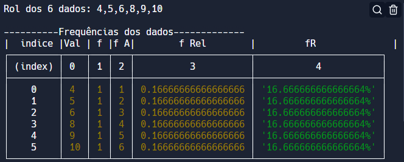

<h2>📋Análise estatística </h2>

Neste projeto  alguns métodos estatísticos são calculados a partir da inserção de dados. As operações contam com distribuições de frequências, medidas de posição, medidas de dispersão e medidas de assimetria. A partir dos resultados obtidos é possível fazer análises mais complexas sobre os dados coletados implementando outros métodos ou relacionando os já usados. 

------

<h2>📌O que foi feito aqui?</h2>

* A base é feita  em Java Script  e no  Visual Studio Code.

* Para usar o programa basta inserir os valores dos dados coletados dentro do array "valores" e rodar a aplicação no console.

* O programa ordena os dados, verifica a quantidade de dados e apresenta alguns tratamentos estatísticos incluindo a divisão dos dados em classes. 

  Exemplo usando o <a href="https://replit.com/~">replit</a>

  

  Val = valor        f = frequência         f A  = frequência absoluta         f  Rel  = frequência relativa 

------

<h2>Softwares e linguagens usados 💾<h2>  

###   

------

<h2>Redes📨</h2> 

###                                            

